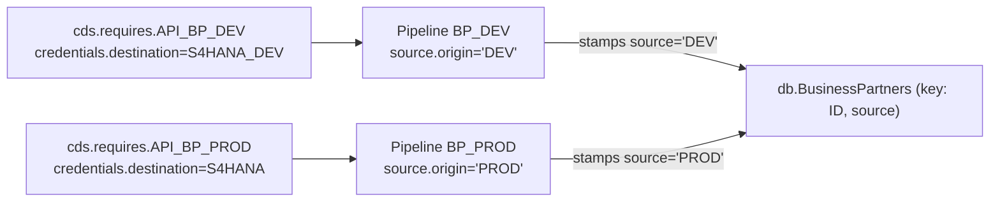
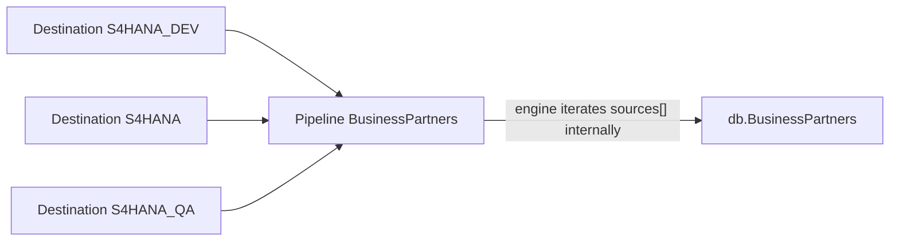

# ADR 0008 — Multi-source replication into a single entity

Status: Proposed
Date: 2026-04-21
Supersedes: —
Extends: ADR 0007 — Infer pipeline intent from config shape

## Context

`cds-data-pipeline` currently states a hard 1:1 rule in [README.md](../README.md):

> **Not a DAG runner.** One source, one target, per pipeline. No fan-in, fan-out, chaining, or composition.

The rule is load-bearing for ADR 0007 — the whole inference machine in [docs/guide/concepts/inference.md](../docs/guide/concepts/inference.md) presumes a single `source.{entity,query}` shape produces a single tracker row and a single WRITE target. `addPipeline` in [srv/DataPipelineService.js](../srv/DataPipelineService.js) encodes this: one pipeline name, one `cds.requires.<service>` key, one target entity.

Real-world CAP replication deployments — exemplified by [gregorwolf/cap-replication-demo](https://github.com/gregorwolf/cap-replication-demo) — routinely need to ingest the same logical entity (`A_BusinessPartner`, `Product`, …) from **multiple instances of the same backend** (e.g. `S4HANA_DEV` + `S4HANA` + `S4HANA_QA`) and materialize all rows into **one local table**. The demo solves this outside the framework with four coordinated pieces:

1. A CDS aspect `aspect source { key source : String(100); }` attached to every replicated entity (`db/schema.cds`), extending the primary key with a destination discriminator so rows from different backends coexist. Every `Association` is extended `... and to_X.source = $self.source` to keep cross-entity traversal scoped to one source system.
2. Destination-parameterized connections: `cds.connect.to(svc, { credentials: { destination, path } })` in `srv/replication-service.js` — one `cds.requires` key is reused to spawn N runtime clients, each bound to a different BTP destination.
3. An `apiMappingConfiguration()` bundle in `srv/map.js` that groups **many entities** behind a single API (`API_BUSINESS_PARTNER` → `A_BusinessPartner`, `A_Customer`, `A_CustomerSalesArea`, `A_CustomerSalesAreaText`, `A_BusinessPartnerAddress`) with a shared filter (`SalesOrganization: { in: ['1010'] }`). One trigger loads the whole family.
4. A `messaging.on('sap.s4.beh.businesspartner.v1.BusinessPartner.Changed.v1', …)` subscription in `srv/replication-service.js` that does event-driven single-row upserts alongside the polling full-refresh, and a reverse-merge action `UpsertService.entitiesInS4(source, target, entity)` in `srv/upsert-service.js` that consolidates rows from one source destination into another by concatenating `LargeString` fields.

This ADR decides how `cds-data-pipeline` absorbs the multi-source scenario without contradicting ADR 0007, and enumerates the adjacent capability gaps the demo exposes.

## Decision summary

- Ship a first-class **origin-stamping model** — a CDS aspect `plugin.data_pipeline.sourced` (adjective name; the key field inside is the noun `source`) plus a `source.origin` label on `addPipeline` — in v1. The label is a bare string the default MAP stamps into the `source` key column; it carries no transport meaning.
- Keep the **1:1 engine model** from ADR 0007 intact (Option A below). Multi-source is expressed as N sibling pipelines sharing a target and an origin value; the engine does not gain a `sources: [...]` fan-in surface in v1.
- **Destination / credential binding stays in `cds.requires`** — one `cds.requires` entry per backend, with destinations supplied through `credentials.destination` or profile overrides (`[hybrid]`, `[production]`). The engine never multiplexes one service key across destinations at runtime.
- Re-scope `flush()` to be **per-origin** when the target has the aspect.
- Defer messaging/CDC, multi-entity registration sugar, reverse-merge, and outbound CloudEvents to v2–v5. Each ships in its own ADR-sized increment.

## Capability gap inventory (vs. `gregorwolf/cap-replication-demo`)

| ID | Gap | Today in `cds-data-pipeline` | Phase |
|---|---|---|---|
| G1 | **Source discriminator aspect** | No shipped aspect analogous to `replication.source`. Consumers rebuild the pattern every time, usually getting the association-`source` extension wrong. | v1 |
| G2 | **Origin label on registration** | `addPipeline` has no way to stamp a source label into the target when multiple pipelines share a target entity. Consumers build the pattern manually in MAP hooks and get per-source flush wrong. | v1 |
| G3 | **Per-source scoped flush / delta** | `POST /pipeline/flush` in [srv/DataPipelineManagementService.js](../srv/DataPipelineManagementService.js) wipes the whole target entity. `lastSync` / `lastKey` are already per-pipeline, so the read path is fine; the write/clear path is not. | v1 |
| G4 | **Messaging / event-driven runs** | [srv/adapters/factory.js](../srv/adapters/factory.js) knows only `odata`, `odata-v2`, `rest`, `cqn`. No first-class event ingestion that shares the same `PipelineRuns` / MAP path as batch. See **[ADR 0009 — Event-driven pipeline runs](0009-event-driven-pipeline-runs.md)** (proposed API: `handleEvent` + two payload strategies; supersedes the earlier “`MessagingAdapter` + `source.kind: 'messaging'`” sketch for the first shippable increment). | v2 |
| G5 | **Multi-entity-per-API registration sugar** | Consumers call `addPipeline` N times per API family, duplicating `source.service`, shared filter, schedule, delta config. | v3 |
| G6 | **Reverse-merge / cross-source consolidation recipe** | The demo's `UpsertService.entitiesInS4` pattern (pick source X, push its rows into destination Y, concatenating `LargeString` fields) has no documented equivalent. | v4 |
| G7 | **Outbound CloudEvents emission after WRITE** | Doable today with `srv.after('PIPELINE.WRITE', …)`, but no recipe, no `emit: { channel, event }` sugar, no outbox wiring. | v5 |

## Core design — modeling fan-in

Two options are in scope. The ADR lands on Option A; Option B is documented so we can revisit without re-litigating the gap.

### Option A — N sibling pipelines + origin stamp (chosen)



- Engine stays 1:1 per ADR 0007. Plugin ships the `plugin.data_pipeline.sourced` aspect + a `source.origin` label on `addPipeline`.
- **No destination multiplexing inside the engine.** To ingest from backend X and backend Y, define two `cds.requires` entries (each with its own `credentials.destination`) and register two pipelines. `cds.connect.to(source.service)` keeps treating each key as an opaque connection spec.
- `Pipelines.origin` is populated from `source.origin` at registration. `lastSync` / `lastKey` / `status` remain per-pipeline, so delta watermarks never collide across origins.
- The default MAP stamps `source = <origin>` on every row; UPSERT uses the extended compound key; `flush()` becomes `DELETE ... WHERE <aspect.source> = <origin>`.

Trade-offs:

- **Zero ADR-0007 churn.** The inference table still reads one `source.*` shape per pipeline.
- **CAP-native credential layering.** `cds.requires` + profile overrides (`[hybrid]`, `[production]`) is already where destinations and credentials live; the plugin does not reinvent that layer.
- **N rows in the management UI** — one per `(entity, origin)` pair. This is exactly what ops teams want for troubleshooting a single-origin outage, but it does mean a BP-family ingest from three origins shows as 5 × 3 = 15 rows.
- **`source` key column leaks into projections.** Consumers filter or `exclude { source }` in projections when they want "a random row per business key". This is a modeling tax, not an engine tax.

### Option B — first-class `sources: [...]` fan-in



- `addPipeline({ sources: [{ service, origin }, ...], target, ... })`. Engine loops sources (sequential or bounded-parallel) and treats each source iteration as a sub-run.
- Requires: a new kind `fan-in` in the inference table ([docs/guide/concepts/inference.md](../docs/guide/concepts/inference.md)); per-source tracker rows (`PipelineRuns.origin`); per-source retry; and relaxing the "single-winner `on` handler" assumption called out in [README.md](../README.md) L12 because MAP/WRITE hooks must now receive `req.data.origin` to route correctly.

Trade-offs:

- **One logical pipeline in the UI.** Clean for reporting rollups.
- **Contradicts a stated non-goal** in the README. We would have to re-word the "what this isn't" bullet.
- **Larger API + tracker surface.** The config-shape inference in ADR 0007 either gains a third axis (`sources` count) or tolerates shape ambiguity between `source` and `sources[]`.
- **Hook semantics become a breaking change.** Existing `srv.before('PIPELINE.MAP', 'BP', ...)` handlers suddenly run per-source and must be `origin`-aware.

### Why Option A wins for v1

Option A ships in a focused PR (one new aspect, one tracker column, origin-aware flush, default-MAP patch). It does not touch the inference table, does not rewrite hook semantics, and lets Option B remain an additive future step if N-pipeline ergonomics become painful at production scale.

## Data model — the `plugin.data_pipeline.sourced` aspect

Ship this aspect in [db/index.cds](../db/index.cds) alongside the existing `Pipelines` / `PipelineRuns` definitions. The aspect name is an adjective (`sourced` — "this entity is sourced from some backend") and the key field it contributes is the noun `source`, so consumer usage reads naturally as `entity BusinessPartners : bp.A_BusinessPartner, sourced { ... }`:

```cds
namespace plugin.data_pipeline;

aspect sourced {
    key source : String(100);
}
```

Consumer usage — note the association-`source` extension, which is easy to forget and the main reason the aspect must ship *with the plugin* rather than live in application code:

```cds
using { plugin.data_pipeline.sourced } from 'cds-data-pipeline/db';
using { API_BUSINESS_PARTNER as bp } from '../srv/external/API_BUSINESS_PARTNER';

entity BusinessPartners : bp.A_BusinessPartner, sourced {
    to_Addresses : Association to many BusinessPartnerAddresses
        on  to_Addresses.BusinessPartner = $self.BusinessPartner
        and to_Addresses.source          = $self.source;
}

entity BusinessPartnerAddresses : bp.A_BusinessPartnerAddress, sourced {
    to_BusinessPartner : Association to one BusinessPartners
        on  to_BusinessPartner.BusinessPartner = $self.BusinessPartner
        and to_BusinessPartner.source          = $self.source;
}
```

## Registration API — one `cds.requires` entry per backend

Each backend instance gets its own `cds.requires` entry. Destinations and credentials live in the CAP config layer; the pipeline engine does not see them.

```json title="package.json (cds.requires)"
{
  "cds": {
    "requires": {
      "API_BP_DEV": {
        "kind": "odata",
        "model": "./srv/external/API_BUSINESS_PARTNER",
        "credentials": { "destination": "S4HANA_DEV", "path": "/sap/opu/odata/sap/API_BUSINESS_PARTNER" }
      },
      "API_BP_PROD": {
        "kind": "odata",
        "model": "./srv/external/API_BUSINESS_PARTNER",
        "credentials": { "destination": "S4HANA",     "path": "/sap/opu/odata/sap/API_BUSINESS_PARTNER" }
      }
    }
  }
}
```

`addPipeline` grows a single optional field — `source.origin` — whose only job is to be stamped into the target's `source` key column:

```javascript
await pipelines.addPipeline({
    name: 'BP_DEV',
    source: { service: 'API_BP_DEV',  entity: 'A_BusinessPartner', origin: 'DEV' },
    target: { entity: 'db.BusinessPartners' },
    delta:  { field: 'modifiedAt', mode: 'timestamp' },
    schedule: 600000,
});

await pipelines.addPipeline({
    name: 'BP_PROD',
    source: { service: 'API_BP_PROD', entity: 'A_BusinessPartner', origin: 'PROD' },
    target: { entity: 'db.BusinessPartners' },
    delta:  { field: 'modifiedAt', mode: 'timestamp' },
    schedule: 600000,
});
```

Engine behavior when `source.origin` is set:

1. `_validateConfig` requires the target entity to include the `plugin.data_pipeline.sourced` aspect (or any entity with a `key source : String(N)` element — the runtime check is structural). If absent, throw with a message pointing at the aspect import path `using { plugin.data_pipeline.sourced } from 'cds-data-pipeline/db';`.
2. `_validateConfig` rejects `source.origin` + `source.query` (materialize is origin-agnostic).
3. `_normalizeConfig` writes `origin` to `Pipelines.origin` on the tracker row.
4. The default MAP handler stamps `record.source = origin` before UPSERT — only when the target includes the aspect.
5. The default WRITE keeps UPSERT semantics; the composite key `(businessKey, source)` is automatic because the aspect added `source` to the primary key.
6. `flush()` becomes `DELETE FROM <target> WHERE source = <origin>` when the target has the aspect. Legacy pipelines (no aspect, no origin) keep today's full-table semantics.

> **Note — destination multiplexing is not supported.** CAP's `cds.requires` + profile overrides (`[hybrid]`, `[production]`) is the canonical way to bind one service definition to one destination. The `gregorwolf/cap-replication-demo` pattern of calling `cds.connect.to(svc, { credentials: { destination, path } })` at runtime to multiplex destinations is intentionally not supported by the engine — define a second `cds.requires` entry instead.

## Impacted files (for the eventual implementation)

| File | Change |
|---|---|
| [db/index.cds](../db/index.cds) | Add `aspect sourced { key source : String(100); }` in namespace `plugin.data_pipeline`. Add `origin : String` to `Pipelines`. Add `origin : String` (run-scoped echo) to `PipelineRuns` for observability. |
| [srv/DataPipelineService.js](../srv/DataPipelineService.js) | `_validateConfig`: require target-aspect when `source.origin` is set; mutual exclusion with `source.query` (materialize pipelines are origin-agnostic). `_normalizeConfig`: populate `origin`. Default MAP: stamp `source = origin` on every row. Add `DOC_REF_FAN_IN` constant mirroring `DOC_REF` (pointing at the public multi-source recipe). |
| [srv/lib/Pipeline.js](../srv/lib/Pipeline.js) | WRITE path: echo `source = origin` on every record (belt-and-braces for consumer-overridden MAP). `flush()`: add `WHERE source = <origin>` predicate when aspect is present; log the scoped delete count. |
| [srv/DataPipelineManagementService.js](../srv/DataPipelineManagementService.js) | `flush` action honors per-origin scope. `status(name)` surfaces `origin`. `Pipelines` projection exposes `origin`. |
| [srv/adapters/factory.js](../srv/adapters/factory.js) | v2: route `kind: 'messaging'` to `MessagingAdapter`. |
| New: `srv/adapters/MessagingAdapter.js` | v2. Subscribes via `cds.connect.to('messaging')`, surfaces an async iterable of single-row batches to `PIPELINE.READ`, maps CloudEvents `subject` → primary key via a configurable `keyFromEvent(msg)` function. |
| [docs/guide/concepts/inference.md](../docs/guide/concepts/inference.md) | Add a "Multi-source (origin stamp)" sub-section to the derived-kind table noting that `source.origin` is orthogonal to `kind` — it composes with `replicate` and `move`, never with `materialize`. |
| [docs/reference/features.md](../docs/reference/features.md) | Add a "Multi-source fan-in" row under Source adapters. |
| New: `docs/guide/recipes/multi-source.md` | End-to-end worked example — BP from `API_BP_DEV` + `API_BP_PROD` into one local table, including per-origin flush assertion. |
| New: `docs/guide/recipes/merge-sources.md` | v4. Reverse-merge pattern (`UpsertService.entitiesInS4` analogue) expressed as a WRITE-hook recipe. |
| New: `docs/integration/messaging.md` | v2. CDC adapter reference. |
| [README.md](../README.md) | Re-word the "Not a DAG runner" bullet to clarify that "fan-in" there means *engine-internal* composition — multi-source-to-one via sibling pipelines + origin stamp is supported. |

Explicit non-change: the engine never calls `cds.connect.to(service, { credentials: { destination } })`. Destination resolution stays in `cds.requires`.

## Phased roadmap

### v1 — Multi-source fan-in via origin stamp (this ADR)

Ships: G1 + G2 + G3.

Deliverables:

- `plugin.data_pipeline.sourced` aspect.
- `source.origin` label on `addPipeline`; `Pipelines.origin` + `PipelineRuns.origin` tracker columns.
- Default MAP stamps `source = origin`; default flush scopes to `source = origin`.
- `docs/guide/recipes/multi-source.md` showing the two-`cds.requires`-entries-plus-two-pipelines pattern.
- README clarification that fan-in is supported via sibling pipelines + origin stamp.

### v2 — Event-driven runs + messaging (G4)

**Normative design:** [ADR 0009 — Event-driven pipeline runs](0009-event-driven-pipeline-runs.md) — `DataPipelineService` API to run micro-runs (key vs payload), shared MAP/WRITE, default watermark separation from batch, optional `PipelineRuns` event metadata. Application registers `messaging.on` (v1) or optional declarative topic wiring later.

Earlier sketch (`MessagingAdapter` + `source.kind: 'messaging'`) is **not** the first deliverable; a dedicated `handleEvent` path is preferred. A factory `kind: 'messaging'` may still wrap the same internals in a follow-up.

### v3 — Multi-entity-per-API registration sugar

Ships: G5.

Deliverables:

- `pipelines.addPipelineGroup({ source: { service, origin }, entities: [...], sharedFilter, schedule, delta })` → expands internally to N `addPipeline` calls with auto-derived names (`<group>__<entity>__<origin>`).
- A group is scoped to one `cds.requires` service by definition — "all entities behind this backend replicate together". Ingesting the same family from a second backend is a second `addPipelineGroup` call.
- No schema or tracker change — each expanded pipeline is still a v1-shape sibling.
- `docs/guide/recipes/pipeline-groups.md`.

### v4 — Reverse-merge recipe

Ships: G6.

Deliverables:

- `docs/guide/recipes/merge-sources.md`: picking a source origin, pushing its rows back to a target backend, with the demo's `LargeString` concatenation pattern documented as one of several merge strategies (overwrite / concat / last-write-wins).
- No engine change — pure application-code recipe built on the existing WRITE hook.

### v5 — Outbound CloudEvents emission

Ships: G7.

Deliverables:

- `docs/guide/recipes/emit-cloud-events.md` using `srv.after('PIPELINE.WRITE', …)`.
- Optional `emit: { channel, event }` sugar on `addPipeline` that installs the after-hook at registration time.

## Acceptance criteria (v1)

- Back-compat: existing pipelines without `source.origin` keep working unchanged; `Pipelines.origin` defaults to `null`. No data migration required.
- Flushing pipeline `BP_DEV` leaves `source = 'PROD'` rows untouched — asserted in `docs/guide/recipes/multi-source.md` with a SQL snippet: `SELECT COUNT(*) FROM db.BusinessPartners WHERE source = 'PROD'` before and after `POST /pipeline/flush { name: 'BP_DEV' }`.
- The `cds w` startup log extends the ADR-0007 shape line with an `origin=DEV` suffix when present.
- `DOC_REF` in [srv/DataPipelineService.js](../srv/DataPipelineService.js) gains a sibling `DOC_REF_FAN_IN` pointing at the public multi-source recipe URL, used in the new validation messages (target-aspect-missing and `origin + query` rejection).
- `_validateConfig` rejects: (a) `source.origin` + `source.query` (materialize is origin-agnostic); (b) `source.origin` set on a target entity that does not include the `plugin.data_pipeline.sourced` aspect, with an error message naming the aspect import path.

## Non-goals

- Bidirectional sync. The v4 reverse-merge recipe is an application-layer flow on top of the engine, not a new engine capability.
- DAG composition / pipeline chaining — still prohibited per ADR 0007 and the README.
- Cross-tenant control plane.
- First-class `sources: [...]` fan-in (Option B). Revisit only when Option A ergonomics demonstrably fail.
- Destination multiplexing inside the engine. `cds.connect.to(source.service, { credentials: { destination } })` overrides at pipeline-resolution time are explicitly not supported; use a second `cds.requires` entry instead.

## Observability compensation (per ADR 0007 §"Observability compensation")

The existing startup line format from ADR 0007 —

```
[cds-data-pipeline] registered 'BP_DEV' — entity-shape from API_BP_DEV.A_BusinessPartner → db.BusinessPartners, mode=delta(timestamp modifiedAt), adapter=ODataAdapter
```

becomes, when `source.origin` is set:

```
[cds-data-pipeline] registered 'BP_DEV' — entity-shape from API_BP_DEV.A_BusinessPartner → db.BusinessPartners, mode=delta(timestamp modifiedAt), adapter=ODataAdapter, origin=DEV
```

The service key itself carries the backend identity (one `cds.requires` entry per backend), so no `service@destination` decoration is needed — the `origin=…` suffix makes the multi-instance nature visible without documentation lookup, matching the "inference is visible in the log" principle from ADR 0007.

## References

- ADR 0007 — Infer pipeline intent from config shape.
- [gregorwolf/cap-replication-demo](https://github.com/gregorwolf/cap-replication-demo) — specifically `db/schema.cds`, `srv/replication-service.js`, `srv/upsert-service.js`, `srv/map.js`, `srv/event-service.js`.
- [docs/guide/concepts/inference.md](../docs/guide/concepts/inference.md) — the inference table this ADR composes with.
- [README.md](../README.md) L19 — the "Not a DAG runner" non-goal this ADR refines.
