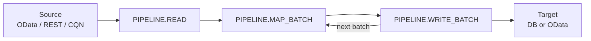

# Introduction

::: warning Work in progress
This plugin is under active development. APIs, schema, and documentation are still evolving and may change before a stable release.
:::

## What it is

**cds-data-pipeline** is a **CAP plugin** for scheduled, traceable data movement between CAP services. Each pipeline has **one source** and **one target**. A run follows a fixed **`READ → MAP → WRITE`** order. Every phase is a **`PIPELINE.*` event** on `DataPipelineService`, so you use the standard **`before` / `on` / `after`** hooks — no new runtime to learn.

**Phases at a glance** (`PIPELINE.START` / `PIPELINE.DONE` omitted):



## Why it exists

CAP makes it easy to read from one service and write into another. But many real apps need to **move** data — for a local copy, reporting, or to avoid live federation overhead. See [CAP Data Federation](https://cap.cloud.sap/docs/guides/integration/data-federation) for typical scenarios. The capire walkthroughs show the pattern, but every project ends up copying and maintaining the same loop.

**cds-data-pipeline** encapsulates that pattern in a reusable plugin:

- **Pluggable adapters** — OData, CQN, REST, local DB, custom hooks
- **Delta strategies** — only fetch what changed
- **Scheduling** — in-process, queued, or external
- **Management API** at `/pipeline` with run history and statistics
- **Pipeline Monitor** UI

It builds on `cds` services, consumption views, `cds.spawn`, and standard hooks — staying **idiomatic to CAP**.

## Scope

`cds-data-pipeline` is **application-layer only**. It moves data **inside** one CAP app via `cds.connect.to`, destinations, and credentials. It does **not** replace SAP Integration Suite, Datasphere replication flows, HANA SDI, or similar cross-landscape products.

### Minimal example

The snippet below reads `A_BusinessPartner` from a remote OData service, upserts rows into a local table, and re-runs every 10 minutes. Delta mode `timestamp` uses `modifiedAt` as the watermark so later runs only pull changed rows.

You call `addPipeline(...)` directly, or let an annotation-driven layer like [cds-data-federation](https://www.npmjs.com/package/cds-data-federation) generate the wiring for you.

```javascript
const cds = require('@sap/cds');

const pipelines = await cds.connect.to('DataPipelineService');

await pipelines.addPipeline({
    name: 'BusinessPartners',
    description: 'Replicate business partners into the local application.',
    source: { service: 'API_BUSINESS_PARTNER', entity: 'A_BusinessPartner' },
    target: { entity: 'db.BusinessPartners' },
    delta: { field: 'modifiedAt', mode: 'timestamp' },
    schedule: 600_000,
});
```

Runs are tracked and visible at `/pipeline` or in the mounted monitor. See [Get started](get-started.md) for a step-by-step walkthrough.

## SAP data extraction

::: info License carve-out
`@sap/cds` ships under the [SAP Developer License Agreement (3.2 CAP)](https://cap.cloud.sap/resources/license/developer-license-3_2_CAP.txt). Section 1 limits mass extraction from an SAP product to a non-SAP product unless required for **interoperability** with an SAP product. When pointing a pipeline at an SAP source, stay within that carve-out.
:::

## Next

- [Get started](get-started.md) — step-by-step with Northwind and the monitor
- [Concepts](concepts/) — vocabulary, inference, consumption views
- [Feature catalog](../reference/features.md) — full capability list
