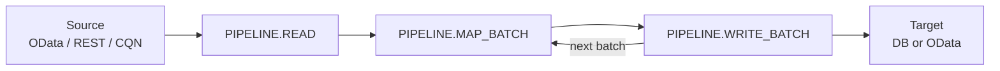

# Introduction

::: warning Work in progress
This plugin is under active development. APIs, schema, and documentation are still evolving and may change before a stable release.
:::

## What it is

**cds-data-pipeline** is a **SAP Cloud Application Programming Model (CAP) application-layer plugin** for traceable, scheduled data movement between **CAP-addressable** services. A pipeline is always **one source** and **one target**; a run walks a fixed **`READ → MAP → WRITE`** order. The implementation surfaces each phase as a **`PIPELINE.*` event** on `DataPipelineService` — the familiar **`before` / `on` / `after`** registration model, not a separate “pipeline runtime” you learn from scratch.

**Phases at a glance** ( **`PIPELINE.START` / `PIPELINE.DONE` omitted** ):



## Why it exists

In SAP CAP, most integration surfaces as **services** — the model makes it natural to **read** from one service and **write** into another. Real apps still run into many scenarios, including those described in [CAP Data Federation](https://cap.cloud.sap/docs/guides/integration/data-federation), where you need to **move** data from one service into another (for a durable local copy, reporting, or a smaller on-disk surface than live federation). The capire walkthroughs show the pattern: that sample is not much code, but the cost is *copying and maintaining* the same loop in every project.

**cds-data-pipeline** is a reusable **CAP application-layer** plugin that encapsulates that pattern: **pluggable** source and target adapters (OData, CQN, REST, local DB, and custom hooks), **delta** strategies, **scheduling** options (in-process, queued, or external), a management **`/pipeline` API**, **run history** and statistics, and a path to a **Pipeline Monitor** UI. Internally it builds on the same levers you already use — `cds` services, consumption views, `cds.spawn` (and related scheduling), and standard hook APIs — so the behavior stays **idiomatic to CAP** instead of a parallel framework on the side.

## Scope

`cds-data-pipeline` is **application-layer only** — it moves data **inside** one CAP app via `cds.connect.to`, destinations, and credentials. It is **not** a replacement for SAP Integration Suite, Datasphere replication flows, HANA SDI, or similar **cross-landscape** products.

### Minimal example

The snippet **registers** a pipeline: **read** the remote **`A_BusinessPartner`** set from a connected OData service (`API_BUSINESS_PARTNER`), **UPSERT** the rows into a local table (`db.BusinessPartners`), and **re-run** on a **10 minute** in-process schedule. **Delta** mode **`timestamp`** uses **`modifiedAt`** as the watermark so later runs only pull rows that actually changed (plus paging under the hood).

For **hand-authored** services, you call `addPipeline(...)` yourself. **Annotation-driven** stacks can sit on the same engine and generate most of that wiring (for example [cds-data-federation](https://www.npmjs.com/package/cds-data-federation)).

```javascript
const cds = require('@sap/cds');

const pipelines = await cds.connect.to('DataPipelineService');

await pipelines.addPipeline({
    name: 'BusinessPartners',
    description: 'Replicate business partners into the local application.',
    source: { service: 'API_BUSINESS_PARTNER', entity: 'A_BusinessPartner' },
    target: { entity: 'db.BusinessPartners' },
    delta: { field: 'modifiedAt', mode: 'timestamp' },
    schedule: 600_000,
});
```

Each run is **tracked** and observable on **`/pipeline`** (or a mounted monitor). Step-by-step setup with a public API and UI is in [Get started](get-started.md).

## SAP data extraction

::: info License carve-out
`@sap/cds` ships under the [SAP Developer License Agreement (3.2 CAP)](https://cap.cloud.sap/resources/license/developer-license-3_2_CAP.txt). Section 1 limits mass extraction from an SAP product to a non-SAP product except where required for **interoperability** with an SAP product. When you point a pipeline at an SAP source, stay within that carve-out.
:::

## Next

- [Get started](get-started.md) — step-by-step with Northwind and the monitor
- [Concepts](concepts/) — vocabulary, inference, consumption views
- [Feature catalog](../reference/features.md) — full capability list
