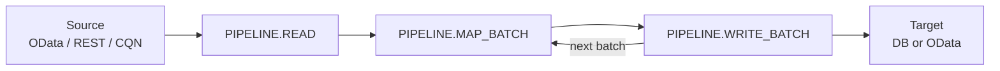

# cds-data-pipeline

!!! warning "Work in progress"
    This plugin is under active development. APIs, schema, and documentation are still evolving and may change before a stable release (May 2026).

**cds-data-pipeline is a CAP application-layer plugin for declarative, traceable, scheduled data movement between CAP-addressable services.** Each pipeline is a linear **`READ → MAP → WRITE`** job between exactly **one source** and **one target**, with a persisted tracker, retry, concurrency guard, management OData at `/pipeline`, and **`PIPELINE.*` event hooks**.

A single run (simplified — **`PIPELINE.START`** / **`PIPELINE.DONE`** omitted):



The plugin is intentionally **low-level**: you can use it directly, or compose it from higher-level packages (for example **cds-data-federation**) that add annotation-driven binding on the same engine.

## Why this plugin exists

CAP applications often need a **durable local copy** of data that already lives in another OData service, REST API, or CQN-backed source — for offline resilience, reporting, joins with local tables, or smaller `$select` surfaces than live federation.

The capire [CAP-level Data Federation guide](https://cap.cloud.sap/docs/guides/integration/data-federation) shows how to do this by hand under [**Service-level replication**](https://cap.cloud.sap/docs/guides/integration/data-federation#service-level-replication): connect to the remote service, page through reads, and **`UPSERT`** into a local `@cds.persistence.table`. The example is **not much code** — but **every app** that wants replication still has to **add, test, and maintain** that logic (and grow it for batching, failures, overlap, and anything operators need to see). Doing that **per entity/service/project** does not scale.

**cds-data-pipeline** is a **shared engine** for the same CAP runtime pattern (`cds.requires`, destinations, auth): you **`addPipeline(...)`** instead of owning another custom loop, and you get **advanced features** on top — delta strategies, internal or external scheduling, a **`/pipeline`** management API, run history and statistics, retries, concurrency control, multi-origin fan-in, and pluggable adapters — catalogued in [Features](reference/features.md). It is **not** an iPaaS, ETL studio, or log-based CDC platform; for boundaries, see [Scope](#scope).

### Features at a glance

| Area | What you get |
|------|----------------|
| **Sources** | OData V2 / V4, REST (pagination and delta URL options), CQN; pluggable **`BaseSourceAdapter`**. [Sources](sources/index.md) |
| **Targets** | Local **DB** (`DbTargetAdapter`), **remote OData** (`ODataTargetAdapter`); pluggable **`BaseTargetAdapter`**. [Targets](targets/index.md) |
| **Shapes** | **Entity-shape** (replicate) vs **query-shape** (materialize); behavior **inferred** from config. [Inference rules](concepts/inference.md) |
| **Consumption views** | Optional **inferred `viewMapping`** from projections. [Consumption views](concepts/consumption-views.md) |
| **Delta** | **Timestamp**, **key**, **datetime-fields** row delta; full / partial refresh for snapshots. |
| **Operations** | **`Pipelines`**, **`PipelineRuns`**, **`execute`**, **`flush`**, **`status`**. [Management Service](reference/management-service.md) |
| **Scheduling** | **Spawn**, **queued**, or **external** `POST /pipeline/execute`. [Scheduling](reference/features.md#scheduling-and-triggers) |
| **Resilience** | **Retry** with backoff; **concurrency guard**. [Resilience](reference/features.md#resilience) |
| **Extensibility** | **`PIPELINE.*` hooks**; custom adapters. [Event hooks](recipes/event-hooks.md) |
| **Multi-origin** | **Fan-in** with **`sourced`** aspect. [Multi-source](recipes/multi-source.md) |

More detail: [Features](reference/features.md).

The example below registers a pipeline and runs it on an in-process schedule:

```javascript
const cds = require('@sap/cds');

const pipelines = await cds.connect.to('DataPipelineService');

await pipelines.addPipeline({
    name: 'BusinessPartners',
    description: 'Replicate business partners into the local application.',

    // The source to fetch the data from
    source: { service: 'API_BUSINESS_PARTNER', entity: 'A_BusinessPartner' },  

    // The target to store the data in                                  
    target: { entity: 'db.BusinessPartners' }, 

    // Optional delta handling support
    delta: { field: 'modifiedAt', mode: 'timestamp' }, 

    // Optional scheduling support
    schedule: 600_000, 
});
```

Every run is automatically tracked and can be monitored via the OData management service at `/pipeline` or in a provided UI5 monitor app.

## Scope

`cds-data-pipeline` is **application-layer only**. It moves data between CAP-addressable services from inside one CAP app, using CAP's own `cds.connect.to`, destinations, and credentials. It is aimed at movement that is internal to a CAP application and does not justify a separate integration product.

It is **not** a replacement for SAP's enterprise integration or data-movement tooling:

- **SAP Integration Suite (Cloud Integration)** — cross-system, cross-protocol integration with a visual modeler and operational monitoring.
- **SAP Datasphere replication flows** — operationally-managed replication into the data fabric.
- **SAP HANA Smart Data Integration (SDI)** — cross-system replication and federation below the app layer.

Those products solve cross-system, cross-protocol, operationally-managed movement. This plugin does not and is not trying to.

<div class="grid cards" markdown>

-   :material-school-outline: **Get started**

    ---

    Install the plugin, import the public Northwind OData V4 API, add a consumption view on `Products`, register your first pipeline, open the monitor, and verify replicated data.

    [:octicons-arrow-right-24: Get started](get-started.md)

-   :material-rocket-launch: **Features**

    ---

    What the plugin offers, grouped by capability — source adapters, management service, observability, scheduling, resilience.

    [:octicons-arrow-right-24: Features](reference/features.md)

-   :material-chart-line: **Pipeline recipes**

    ---

    Four plugin entry points: built-in adapters (no code), custom source adapter, custom target adapter, and CAP-style event hooks on the pipeline phases. Each recipe is a scenario-driven walkthrough.

    [:octicons-arrow-right-24: Recipes overview](recipes/index.md) · [:octicons-arrow-right-24: Built-in replicate](recipes/built-in-replicate.md) · [:octicons-arrow-right-24: Built-in materialize](recipes/built-in-materialize.md)

-   :material-wrench: **Management Service**

    ---

    Inspect and control pipelines at runtime. `Pipelines` and `PipelineRuns` entities, `run` / `flush` / `status` actions, and the programmatic `DataPipelineService` API with event hooks.

    [:octicons-arrow-right-24: Management Service](reference/management-service.md)

-   :material-swap-horizontal: **Sources**

    ---

    Protocol-specific READ phase: OData V2 / V4 (CAP-native), REST (offset / cursor / page pagination, delta URL parameter, nested-response extraction), CQN (in-process CAP services, `cds.requires` DB bindings), plus a pluggable `BaseSourceAdapter` for everything else.

    [:octicons-arrow-right-24: Sources overview](sources/index.md) · [:octicons-arrow-right-24: OData](sources/odata.md) · [:octicons-arrow-right-24: REST](sources/rest.md) · [:octicons-arrow-right-24: CQN](sources/cqn.md)

-   :material-database-arrow-right: **Targets**

    ---

    Protocol-specific WRITE phase: `DbTargetAdapter` (local DB, default), `ODataTargetAdapter` (remote OData V2 / V4 via CAP's connected service), plus a pluggable `BaseTargetAdapter` for non-db / non-OData destinations.

    [:octicons-arrow-right-24: Targets overview](targets/index.md) · [:octicons-arrow-right-24: Local DB](targets/db.md) · [:octicons-arrow-right-24: OData](targets/odata.md) · [:octicons-arrow-right-24: Custom target adapter](targets/custom.md)

</div>

!!! note "SAP data extraction"
    `@sap/cds` ships under the [SAP Developer License Agreement (3.2 CAP)](https://cap.cloud.sap/resources/license/developer-license-3_2_CAP.txt). §1 requires that Customer Applications will not "permit mass data extraction from an SAP product to a non-SAP product, including use, modification, saving or other processing of such data in the non-SAP product, except and only to the extent that the extraction is solely used for and required for interoperability with an SAP product." When you point a pipeline at an SAP source, keep it inside that interoperability carve-out.
