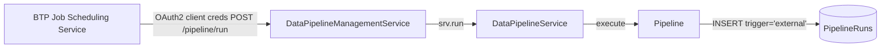

# External scheduling with SAP BTP Job Scheduling Service

**When to pick this recipe:** you want a managed, BTP-native cron schedule for one or more pipelines instead of the in-process `schedule` timer. This is the right shape for production setups that already rely on BTP operations (monitoring, corporate cron policies, centralized run history).

The plugin is pluggable by design: omit `schedule` in `addPipeline(...)` and no internal timer runs. [SAP BTP Job Scheduling Service (JSS)](https://discovery-center.cloud.sap/serviceCatalog/job-scheduling-service?region=all) (or any external cron — Kubernetes `CronJob`, GitHub Actions, Airflow, ...) then calls `POST /pipeline/run` to drive the pipeline.



## 1. Register the pipeline without an internal schedule

Omit `schedule` entirely. Everything else about the pipeline is unchanged.

```javascript
const cds = require('@sap/cds');

module.exports = async () => {
    const pipelines = await cds.connect.to('DataPipelineService');

    await pipelines.addPipeline({
        name: 'BusinessPartners',
        source: { service: 'API_BUSINESS_PARTNER', entity: 'A_BusinessPartner' },
        target: { entity: 'db.BusinessPartners' },
        delta: { field: 'modifiedAt', mode: 'timestamp' },
        // no `schedule` — external trigger owns the cadence
    });
};
```

!!! note "Don't set both"
    Setting `schedule` alongside an external trigger fires the pipeline twice per interval. The tracker's concurrency guard prevents duplicate work (the overlap is a no-op) but wastes CPU and produces noisy logs. Pick one side.

## 2. Secure the management action

Add a `PipelineRunner` scope to `xs-security.json` so only the JSS technical user can POST `/pipeline/run`. The plugin annotates the action with `@(requires: 'PipelineRunner')`.

```json
{
  "xsappname": "cds-data-pipeline-app",
  "tenant-mode": "dedicated",
  "scopes": [
    { "name": "$XSAPPNAME.PipelineRunner",
      "description": "Trigger pipelines via /pipeline/run",
      "grant-as-authority-to-apps": [ "$XSSERVICENAME(cds-data-pipeline-jobscheduler)" ]
    }
  ],
  "role-templates": [
    { "name": "PipelineRunner",
      "description": "Role allowing pipeline runs",
      "scope-references": [ "$XSAPPNAME.PipelineRunner" ]
    }
  ]
}
```

The `grant-as-authority-to-apps` line auto-grants the scope to the technical client of the bound JSS instance (`cds-data-pipeline-jobscheduler` is the instance name used in the `mta.yaml` snippet below), so JSS tokens arrive pre-authorized.

## 3. Bind Job Scheduling in `mta.yaml`

Add the JSS service instance and bind it to the CAP app module.

```yaml
ID: cds-data-pipeline-app
_schema-version: "3.3"
version: 1.0.0

modules:
  - name: cds-data-pipeline-srv
    type: nodejs
    path: gen/srv
    requires:
      - name: cds-data-pipeline-db
      - name: cds-data-pipeline-auth
      - name: cds-data-pipeline-jobscheduler

resources:
  - name: cds-data-pipeline-auth
    type: org.cloudfoundry.managed-service
    parameters:
      service: xsuaa
      service-plan: application
      path: ./xs-security.json

  - name: cds-data-pipeline-jobscheduler
    type: org.cloudfoundry.managed-service
    parameters:
      service: jobscheduler
      service-plan: standard
```

## 4. Define the JSS job

Once the app is deployed, create a JSS job that POSTs into the management service. The service `url` is the app's route, and the `user` / `password` fields carry the OAuth2 client credentials from the XSUAA instance bound above — JSS handles the token exchange.

```json
{
  "name": "replicate-business-partners",
  "description": "Replicate API_BUSINESS_PARTNER into the local DB every 10 minutes",
  "action": "https://cds-data-pipeline-srv.cfapps.<region>.hana.ondemand.com/pipeline/run",
  "httpMethod": "POST",
  "active": true,
  "schedules": [
    {
      "description": "Every 10 minutes",
      "cron": "* * * * */10 0 0",
      "active": true,
      "data": "{\"name\":\"BusinessPartners\",\"trigger\":\"external\",\"async\":true}"
    }
  ]
}
```

Key fields:

- `trigger: "external"` — stamps `trigger='external'` on the resulting `PipelineRuns` row so the run history is honest about its origin. Without this the run is recorded as `manual`.
- `async: true` — the action returns `202 Accepted` immediately; the pipeline runs detached via `cds.spawn`. Use this when the pipeline may exceed the JSS HTTP response window (default is seconds, not minutes). Outcome (success or failure) still lands in `PipelineRuns`.

## 5. Verify

- Tail the app logs — you should see the registration log without the internal-schedule hint.
- Trigger the JSS job manually once; check `GET /pipeline/PipelineRuns?$filter=pipeline_name eq 'BusinessPartners'&$orderby=startTime desc&$top=1`. The top row should show `trigger='external'` and a completed status.
- If JSS reports a 409 or "skipped" message in the plugin logs, a previous run is still in progress. The concurrency guard (optimistic `UPDATE … WHERE status != 'running'`) blocks overlap — increase the cron interval or keep `async: true` so JSS doesn't wait on the in-flight run.
- If JSS reports a 403, the XSUAA scope grant didn't land — re-check `grant-as-authority-to-apps` and rebind the JSS instance.

## Action parameter reference

```
POST /pipeline/run
Content-Type: application/json
Authorization: Bearer <JSS-issued JWT>

{
  "name":    "BusinessPartners",   // required — pipeline registered via addPipeline(...)
  "mode":    "delta",               // optional — 'delta' | 'full'. Defaults to the pipeline's configured mode.
  "trigger": "external",            // optional — 'manual' | 'scheduled' | 'external' | 'event'. Defaults to 'manual'.
  "async":   true                   // optional — if true, returns 202 Accepted and runs detached.
}
```

## See also

- [Reference → Management Service](../reference/management-service.md) — full action surface, tracker schema, and the `RunTrigger` enum.
- [Internal scheduling with the queued engine](internal-scheduling-queued.md) — an alternative when you want persistence and cross-instance single-winner without an external service.
