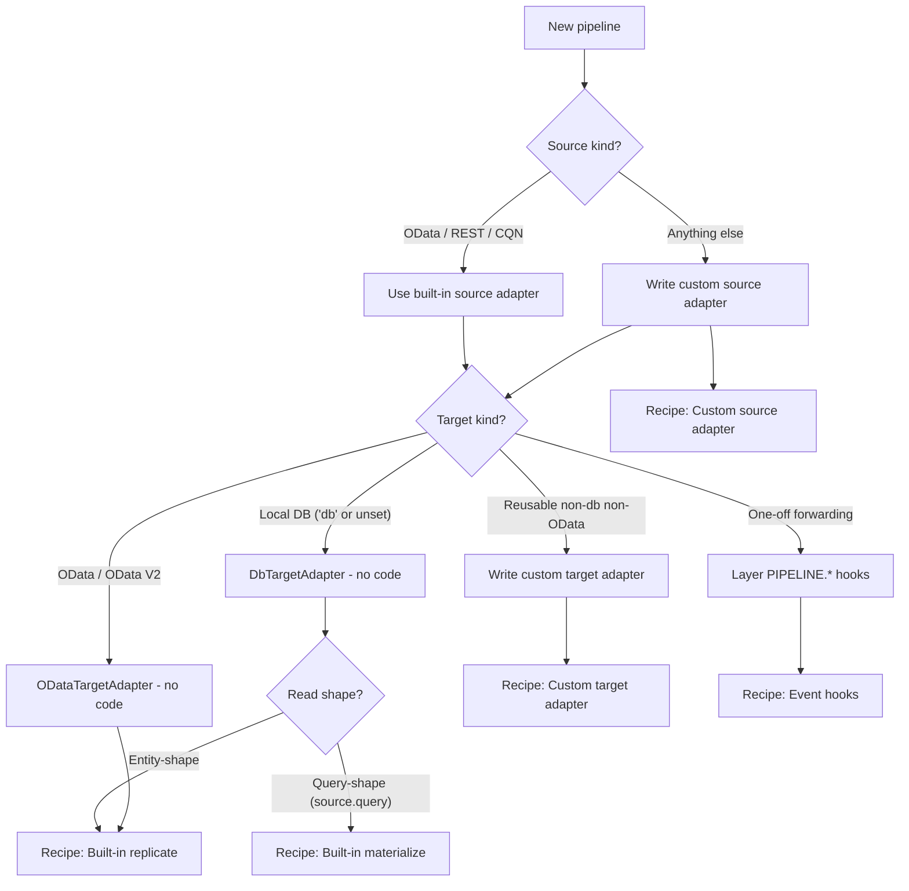

---
hide:
  - navigation
---

# Recipes

Four ways to plug into `cds-data-pipeline`, ordered by how much code you write. Each recipe is a scenario-driven walkthrough — config, code, and the resulting run behaviour — anchored on a single plugin entry point.

| Plugin entry point | When to pick it | Recipe |
|---|---|---|
| **Built-in adapters, no code** — source is OData / REST / CQN, target is local DB or remote OData | Most common case. Row-preserving copy, derived snapshots, move-to-OData. | [Built-in replicate](built-in-replicate.md) · [Built-in materialize](built-in-materialize.md) |
| **Multi-source fan-in** — same logical entity from N backends into one target | DEV / QA / PROD consolidation, cross-region replication into a single reporting table. Sibling pipelines + `source.origin` stamp. | [Multi-source fan-in](multi-source.md) |
| **Custom source adapter** — source transport is not OData / REST / CQN | Reading from CSV, files, proprietary HTTP APIs, message buses, anything else. | [Custom source adapter](custom-source-adapter.md) |
| **Custom target adapter** — target is not the local DB and not an OData service | Forwarding to reporting services, message buses, custom HTTP APIs. Reusable across pipelines. | [Custom target adapter](custom-target-adapter.md) |
| **`PIPELINE.*` event hooks** — minimal-effort customization of any phase | Filter, enrich, normalize, forward, react to completion. `before` / `on` / `after` on `PIPELINE.START / READ / MAP_BATCH / WRITE_BATCH / DONE` in classic CAP style. | [Event hooks](event-hooks.md) |
| **External scheduler (JSS / CronJob)** — drive pipelines from outside the CAP app | Centralized BTP-native cron, corporate scheduling policies, org-level run observability. Omit `schedule`; call `POST /pipeline/execute`. | [External scheduling (JSS)](external-scheduling-jss.md) |
| **In-process queued scheduler** — persistent schedule where only one app instance runs the tick | Scaled deployments (>1 app instance) that want persistence, retry, and cross-instance safety without an external service. `schedule: { every, engine: 'queued' }`. | [Internal scheduling (queued)](internal-scheduling-queued.md) |

## Decision tree

## Use-case labels

The terms *replicate*, *materialize*, and *move-to-service* appear in the recipes as labels for common *combinations* of read shape and target destination. They are documentation vocabulary — not a field on `addPipeline(...)` and not a column on the tracker. See [Concepts → Inference rules](../concepts/inference.md).

| Label | What it maps to | Recipe |
|---|---|---|
| **Replicate** | Entity-shape read, DB target (row-preserving) | [Built-in replicate](built-in-replicate.md) |
| **Materialize** | Query-shape read, DB target (snapshot) | [Built-in materialize](built-in-materialize.md) |
| **Move-to-service** | Entity-shape read, non-DB target | [Built-in replicate → OData target](built-in-replicate.md#to-a-remote-odata-target) · [Custom target adapter](custom-target-adapter.md) · [Event hooks](event-hooks.md) |
