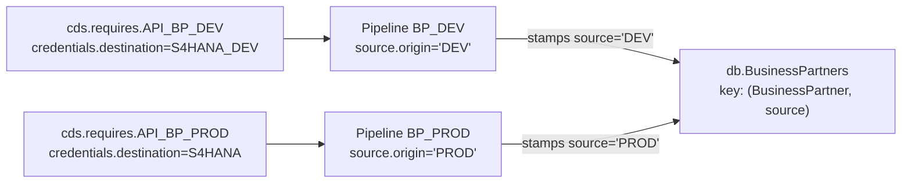

# Multi-source fan-in

**When to pick this recipe:** the same logical entity (`A_BusinessPartner`, `Product`, …) lives in multiple instances of the same backend — DEV / QA / PROD, region A / region B — and you want to land all rows in **one local table** with an origin discriminator so the UI can filter by source system and ops can flush / re-sync one origin without touching the others.

The engine stays 1:1 per the [inference rules](../concepts/inference.md) — you register **N sibling pipelines**, each bound to its own `cds.requires` entry, each stamping its own `source.origin` label into the target's `source` key column. The plugin ships a CDS aspect (`plugin.data_pipeline.sourced`) that extends the primary key so rows from different origins coexist.

## Shape at a glance



## 1 — One `cds.requires` entry per backend

Each backend instance is a separate CAP service binding. Destinations and credentials live in `cds.requires` / profile overrides (`[hybrid]`, `[production]`) — **the engine never multiplexes one service key across destinations**. If you need a third backend, add a third `cds.requires` entry.

```json title="package.json"
{
  "cds": {
    "requires": {
      "API_BP_DEV": {
        "kind": "odata",
        "model": "./srv/external/API_BUSINESS_PARTNER",
        "credentials": { "destination": "S4HANA_DEV", "path": "/sap/opu/odata/sap/API_BUSINESS_PARTNER" }
      },
      "API_BP_PROD": {
        "kind": "odata",
        "model": "./srv/external/API_BUSINESS_PARTNER",
        "credentials": { "destination": "S4HANA",     "path": "/sap/opu/odata/sap/API_BUSINESS_PARTNER" }
      }
    }
  }
}
```

## 2 — Mix in the `sourced` aspect on the target

Import the aspect from the plugin and compose it into every target entity that consolidates multiple origins. **Don't forget the association-`source` extension** — this is the easy-to-miss part and the main reason the aspect ships from the plugin.

```cds
using { plugin.data_pipeline.sourced } from 'cds-data-pipeline/db';
using { API_BUSINESS_PARTNER as bp } from '../srv/external/API_BUSINESS_PARTNER';

entity BusinessPartners : bp.A_BusinessPartner, sourced {
    to_Addresses : Association to many BusinessPartnerAddresses
        on  to_Addresses.BusinessPartner = $self.BusinessPartner
        and to_Addresses.source          = $self.source;
}

entity BusinessPartnerAddresses : bp.A_BusinessPartnerAddress, sourced {
    to_BusinessPartner : Association to one BusinessPartners
        on  to_BusinessPartner.BusinessPartner = $self.BusinessPartner
        and to_BusinessPartner.source          = $self.source;
}
```

The aspect contributes a single element — `key source : String(100)` — which becomes part of the primary key of every entity that mixes it in. The associations must scope on `source` so cross-entity traversal stays inside one origin.

## 3 — Register one pipeline per backend

`source.origin` is a plain label — whatever string identifies the backend for your ops team. The default MAP handler stamps it into each record's `source` field before UPSERT; you never handle it in your own hooks.

```javascript
const cds = require('@sap/cds');

module.exports = async () => {
    const pipelines = await cds.connect.to('DataPipelineService');

    await pipelines.addPipeline({
        name:   'BP_DEV',
        source: { service: 'API_BP_DEV',  entity: 'A_BusinessPartner', origin: 'DEV' },
        target: { entity: 'db.BusinessPartners' },
        delta:  { field: 'modifiedAt', mode: 'timestamp' },
        schedule: 600000,
    });

    await pipelines.addPipeline({
        name:   'BP_PROD',
        source: { service: 'API_BP_PROD', entity: 'A_BusinessPartner', origin: 'PROD' },
        target: { entity: 'db.BusinessPartners' },
        delta:  { field: 'modifiedAt', mode: 'timestamp' },
        schedule: 600000,
    });
};
```

Two sibling pipelines, one shared target, independent `lastSync` / `lastKey` watermarks per origin. A DEV outage does not stall the PROD delta.

## 4 — What the engine does with `origin`

| Phase | With `source.origin` set | Without `source.origin` |
|---|---|---|
| Registration | Writes `origin` to `Pipelines.origin`; the startup log line gains `, origin=DEV` | No origin on the tracker row |
| Default MAP | Stamps `record.source = origin` on every mapped row before WRITE | No stamp |
| Default WRITE | Re-stamps `source = origin` (belt-and-braces for consumer MAP overrides), then UPSERTs with the compound key `(businessKey, source)` | UPSERTs with the declared business key only |
| `mode: 'full'` pre-sync | `DELETE FROM target WHERE source = <origin>` — sibling origins survive | Full `DELETE FROM target` |
| `flush` (`POST /pipeline/flush`) | Same per-origin scoped DELETE | Full `DELETE FROM target` |

See [Inference rules](../concepts/inference.md) for how `origin` composes with the inferred pipeline kind.

## 5 — Validation guarantees

`addPipeline` rejects misconfigurations at registration time:

- **`source.origin` without the aspect on the target** — rejected. The error names the aspect and import path: `using { plugin.data_pipeline.sourced } from 'cds-data-pipeline/db';`.
- **`source.origin` + `source.query`** — rejected. Materialize (query-shape) rebuilds the target snapshot and is origin-agnostic; use per-origin base tables + a shared materialize pipeline if you need derived snapshots across origins.

## 6 — Per-origin flush assertion

Flushing one origin must leave the other origin's rows untouched. Given the two pipelines above and some ingested data:

```sql
-- Baseline
SELECT source, COUNT(*) FROM db.BusinessPartners GROUP BY source;
-- DEV   4221
-- PROD  8132
```

Then:

```http
POST /pipeline/flush
Content-Type: application/json

{ "name": "BP_DEV" }
```

After the flush:

```sql
SELECT source, COUNT(*) FROM db.BusinessPartners GROUP BY source;
-- PROD  8132        ← unchanged
-- (DEV rows gone)
```

The tracker is reset for `BP_DEV` (`lastSync`, `lastKey`, statistics → zero); `BP_PROD`'s tracker row and watermark are untouched.

## Constraints & notes

- **One `cds.requires` entry per backend.** Destination multiplexing inside the engine (`cds.connect.to(svc, { credentials: { destination } })` per pipeline) is explicitly unsupported. If you need two destinations, define two `cds.requires` entries.
- **Origin is a label, not a transport.** The plugin does not parse it, does not route on it, does not validate it against the `cds.requires` key. Use whatever string your ops team reads in the management UI.
- **Projections and UI.** Downstream `@readonly` projections often want "a canonical row per business key". Use `where source = 'PROD'` or `exclude { source }` on the projection to filter or drop the discriminator; see [Concepts → Consumption views](../concepts/consumption-views.md).
- **Legacy pipelines are unaffected.** Pipelines without `source.origin` behave exactly as before — `Pipelines.origin` is `null`, the stamp is a no-op, `flush` and `mode: 'full'` truncate the full target.

## See also

- [Concepts → Inference rules](../concepts/inference.md) — where origin fits in the pipeline-kind table.
- [Built-in replicate](built-in-replicate.md) — the single-origin baseline this recipe extends.
- [Reference → Management Service](../reference/management-service.md) — `flush`, `status`, `run`.
